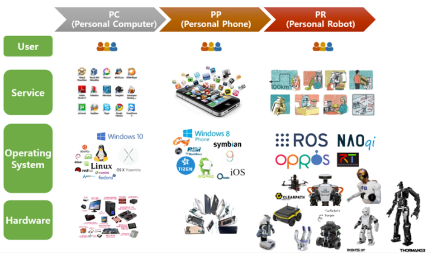

## 플랫폼의 구성요소
  
* 하드웨어(Hardware) : 다양한 하드웨어들과의 결합이 가능한 모듈
* 운영체제(Operating System) : 하드웨어들을 관리 
* 응용프로그램(Application) : 운영체제에서 제공하는 하드웨어 추상화 기반의 소프트웨어 개발환경에서 다양한 서비스를 제공 
* 사용자(User) : 서비스를 이용하는 대상 

## 로봇 소프트웨어 플랫폼 
* 로봇 응용프로그램을 개발할 때 필요한 하드웨어 추상화, 하위 디바이스 제어, 로보틱스에서 많이 사용되는 센싱, 인식, 동시적 자기 위치 추정과 지도 작성(SLAM), 내비게이션(Navigation), 매니퓰레이션(Manipulation)등의 기능구현과 패키지 관리, 개발환경에 필요한 라이브러리와 다양한 개발, 디버깅 도구 등을 포함하는것을 말함 
* 하드웨어들이 플랫폼과 연계되어 추상화가 이루어지므로 하드웨어에 대한 전문 지식이 없다 하더라도 플랫폼을 이용해 응용프로그램을 개발할 수 있음
* 대표적으로 ROS(Robot Operating System)와 일본의 오픈 로보틱스 테크놀로지 미들웨어(OpenRTM), 유럽의 실시간 제어 중심의 OROCOS, 한국의 OPRoS 등이 있음 
* 로봇 소프트웨어 플랫폼이 만들어진 근본적 이유는 로봇 소프트웨어가 너무 다양하고 복잡해서 발생하는 여러 문제를 전 세계의 로봇 연구자가 서로 협업하여 해결하려는 것임 
* 자신이 개발하고자 하는 부분에 집중하고 나머지 기능에 대해서는 관련 패키지를 내려받아 사용 가능(재사용성)
* 최소 실행 단위로 나뉜 노드끼리 데이터를 주고받아야 하는데 플랫폼들은 이 데이터 통신에 대한 전반적인 사항을 모두 갖추고 있음(통신 기반 프로그램)
* 로봇 개발에 꼭 필요한 소프트웨어 도구를 제공하여 개발 편의성을 극대화 
* 플랫폼을 중심으로 커뮤니티가 활성화되어 서로 협업이 가능함
