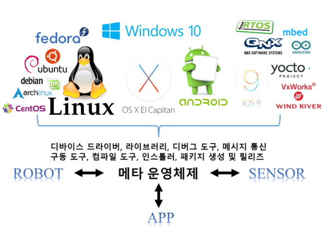
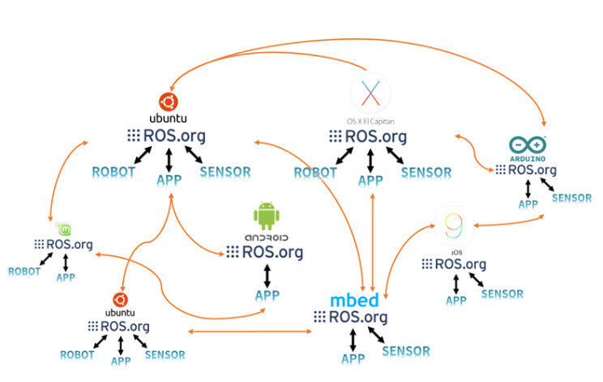
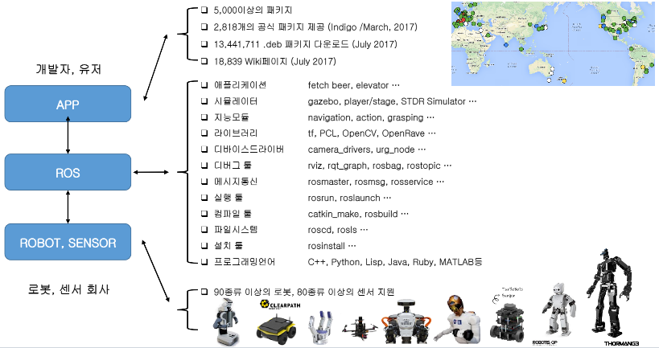

## ROS의 특징
* ROS는 메타 운영체제(Meta-Operating System)로써 전통적인 운영체제 위에 추가로 설치가 됨 
* 전통적인 운영체제에서 제공하는 프로세스 관리 시스템, 파일 시스템, 유저 인터페이스, 프로그램 유틸리티(컴파일러, 스레드 모델 등) 등을 사용
* 메타 운영체제를 미들웨어(Middleware) 또는 소프트웨어 프레임워크(Software framework)라고도 부름 
* 다수의 이기종 하드웨어 간의 데이터 송수신, 스케줄링, 에러 처리 등 로봇 응용프로그램에 필요한 필수 기능들을 라이브러리 형태로 제공
    
* ROS의 데이터 통신은 하나의 운영체제에서도 지원하지만 서로 다른 운영체제, 하드웨어 프로그램 간에도 데이터를 주고받을 수 있어 다양한 하드웨어가 사용되는 로봇 개발에 매우 적합
    
* 최소 단위의 실행 가능한 프로세스(Node) 형태로 프로그램하며, 각 프로세스는 독립적으로 실행되면서 유기적으로 데이터를 주고 받음
* 같은 목적을 갖는 복수 개의 프로세스를 패키지 단위로 관리하기 때문에 개발은 물론 사용하기에도 편하고 공유 및 수정 후 재배포도 용이

## ROS의 구성 
* 클라이언트 라이브러리 : 다양한 프로그래밍 언어를 지원 
* 로보틱스 애플리케이션 : 서비스용 응용프로그램 
* 로보틱스 애플리케이션 프레임워크 : 다양한 로보틱스 응용프로그램의 작성을 도움 
* 커뮤니케이션 : 데이터 통신 지원 
* 하드웨어 인터페이스 : 하드웨어 제어 
* 소프트웨어 개발 툴, 시뮬레이션 : 가상의 공간에서 로봇을 제어해 볼 수 있음 
    
