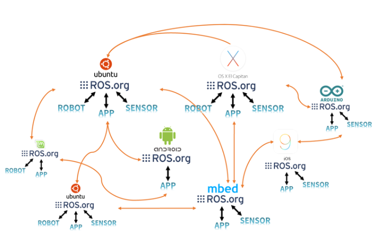

## ROS란? 
* ROS는 로봇 소프트웨어를 개발하기 위한 소프트웨어 프레임워크이다.
* ROS의 진정한 목적은 로보틱스 소프트웨어 개발을 전세계 레벨에서 공동작업 가능하도록 생태계를 구축하는 것이다.
* ROS는 메타 운영체제(Meta-Operating System)이다. 
> * 전통적인 운영체제(Linux, Windows, OS-X, Android등)를 이용하여 로봇 응용 프로그램을 개발하기 위한 필수 기능들을 라이브러리 형태로 제공 
> *  
* ROS는 이기종 디바이스 간의 통신을 지원한다.
> *  ROS의 데이터 통신은 하나의 운영체제에서도 지원하지만 서로 다른 운영체제, 하드웨어 프로그램 간에도 데이터를 주고받을 수 있어 다양한 하드웨어가 사용되는 로봇 개발에 매우 적합하다.
> *  

## 현재의 ROS 생태계 
*  

## ROS의 특징 
1. 통신 인프라 
> *  
2. 로봇 관련 다양한 기능 지원
> * 
3. 다양한 개발도구 지원 
> *  
