## ROS 용어
* Node : 최소단위의 실행 가능한 프로세서 
* Package : 하나 이상의 Node, Node 실행을 위한 정보등을 묶어놓은 것 
* Message : 메시지를 통해 Node간의 데이터를 주고 받게된다. 
* Master : Node와 Node 사이의 연결과 메시지 통신을 위한 네임 서버와 같은 역할을 한다. roscore가 실행 명령어이며, 마스터를 실행하면 각 노드의 이름을 동록하고 필요에 따라 정보를 받을 수 있다. Master 없이는 노드간의 접속, Topic과 Service와 같은 메시지 통신을 할 수 없다. 

## Message 통신 방식 
1. Topic, Publisher, Subscriber
> * 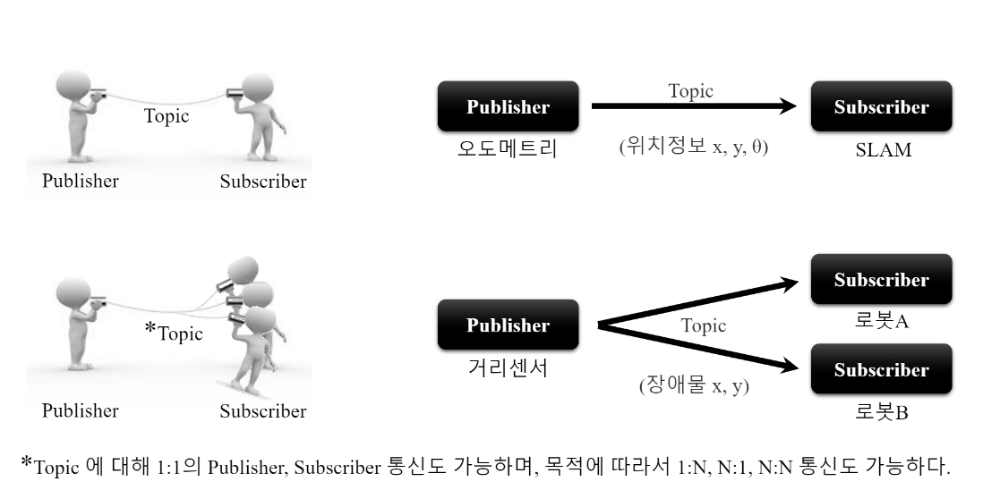 
> * Publisher Node가 하나의 이야깃거리에 대해서 Topic으로 Master에 등록한 후, 이야깃거리에 대한 이야기를 메시지 형태로 퍼블리시한다.
> * 이야깃거리를 수신받기를 원하는 Subscriber Node는 Master에 등록된 Topic의 이름에 해당하는 Publisher Node의 정보를 받는다.
> * 이 정보를 기반으로 Subscriber Node는 Publisher Node와 직접 연결하여 메시지를 Topic으로 송수신하게 된다.  
> * Topic 통신 방식은 비동기 방식이라 필요에 따라서 주어진 데이터를 전송하고 받기에 좋은 방법이다. 
> * 한 번의 접속으로 지속적인 메시지를 송수신하기 때문에 지속해서 메시지를 발송해야 하는 센서 데이터에 적합하여 많이 사용된다. 
2. Service, Service Server, Service Client
> * 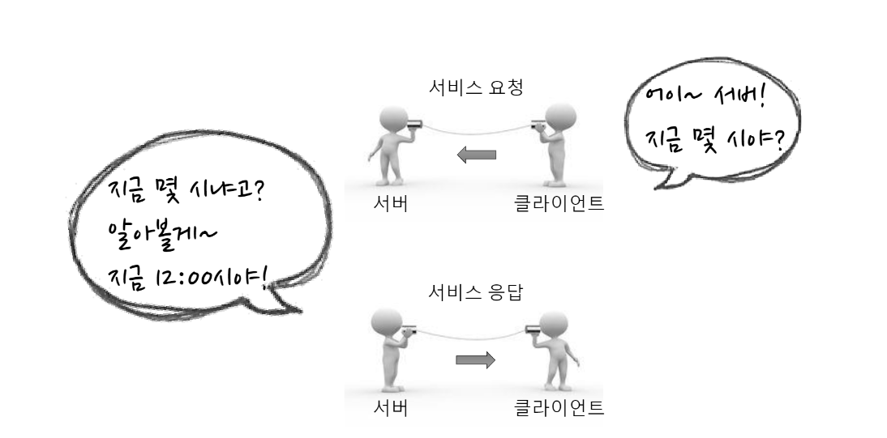 
> * 특정 목적의 작업에 해당하는 서비스를 요청하는 Service Client와 서비스 응답을 담당하는 Service Server 간의 동기적 양방향 서비스 메시지 통신을 말한다. 
> * 한 번의 접속으로 지속적 통신이 아닌 서비스의 요청과 응답이 완료되면 연결된 두 노드의 접속은 끊긴다. 
3. Action, Action Server, Action Client
> * 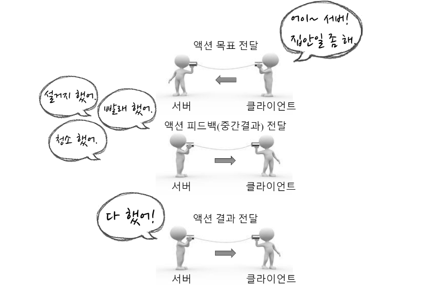 
> * 서비스처럼 양방향을 요구하나 요청 처리 후 응답까지 오랜 시간이 걸리고 중간 결괏값이 필요한 경우에 사용되는 메시지 통신 방식이다. 
> * 서비스와 통신방식이 비슷하지만 중간 결괏값에 해당하는 feedback이 추가되었다.

### Message 통신 과정 
1. 마스터 구동 : XMLRPC(XML-Remote Procedure Call) 
* $ roscore 
* 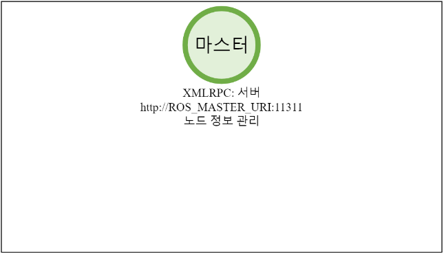
2. Subscriber Node 구동 
* $ rosrun Package_name Node_name
* 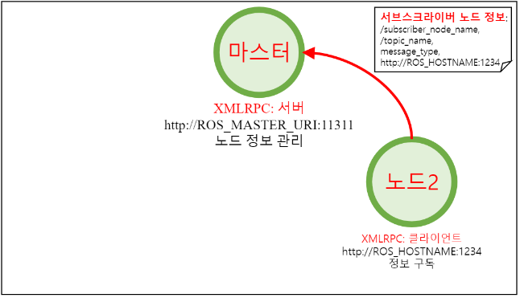
3. Publisher Node 구동
* $ rosrun Package_name Node_name
* 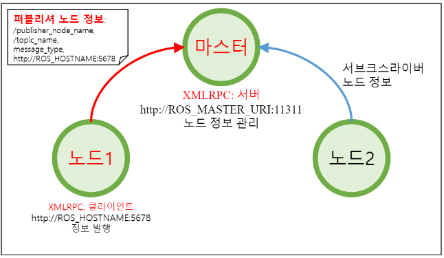
4. Publisher 정보 알림
* Master는 Subscriber Node에게 새로운 Publisher 정보를 알린다.
* 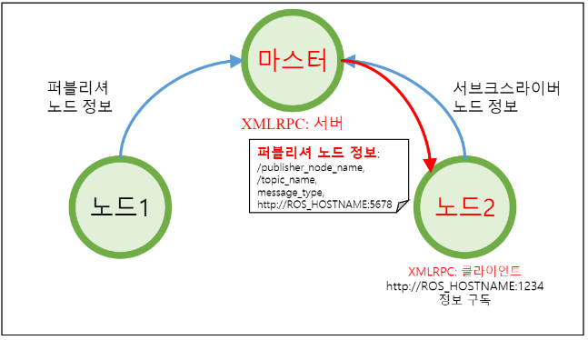 
5. Publisher Node에 접속 요청
* Master로부터 받은 Publisher 정보를 이용하여 TCPROS 접속을 요청
* 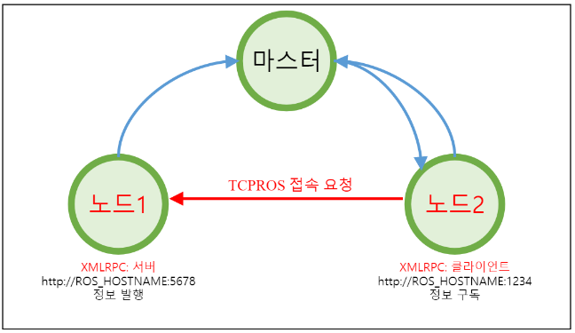
6. Subscriber Node에 접속 응답
* 접속 응답에 해당되는 자신의 TCP URI 주소와 포트번호를 전송 
* 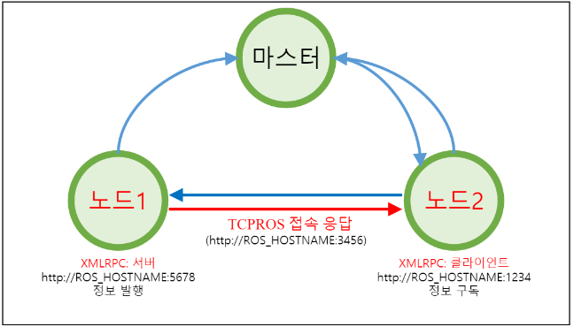
7. TCP 접속 
* TCPROS를 이용하여 Publisher Node와 직접 연결한다. 
* 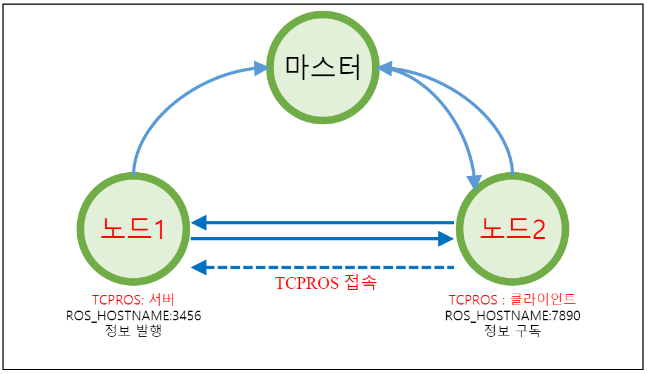
8-1. Topic 메시지 전송 
* Publisher Node는 Subscriber Node에게 메시지를 전송
* 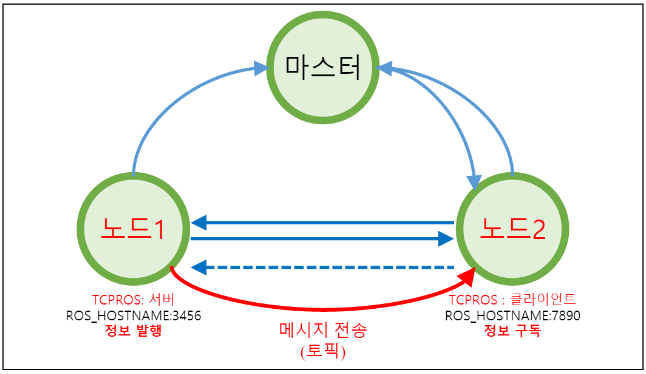
* Topic방식에서는 접속을 끊지 않는 이상 지속적으로 메시지를 전송한다. 
* 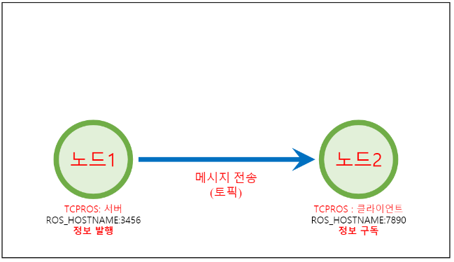
8-2. Service 메시지 전송
* 1회에 한해 접속, 서비스 요청 및 서비스 응답이 수행되고 서로간의 접속을 끊는다.
* 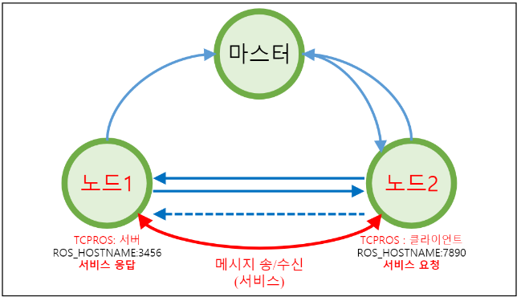

## Message 데이터 형태 
* Parameter : Node에서 사용되는 설정값이다. 필요에 따라서 외부에서 읽거나 쓸 수 있고, 실시간으로 외부에서 쓰기 기능을 이용하여 설정값을 변경할 수 있다. 예를 들어 외부 장치와 연결되는 PC의 USB 포트나 카메라 캘리브레이션 값, 모터 속도나 명령어들의 최댓값과 최솟값 등의 설정을 지정할 수 있다. 
* Parameter Server : Package에서 Parameter를 사용할 때, 각 Prameter를 등록하는 서버를 말한다. Parameter Server는 Master의 한 기능이기도 하다. 
* ROS 메시지 데이터 구조
> * 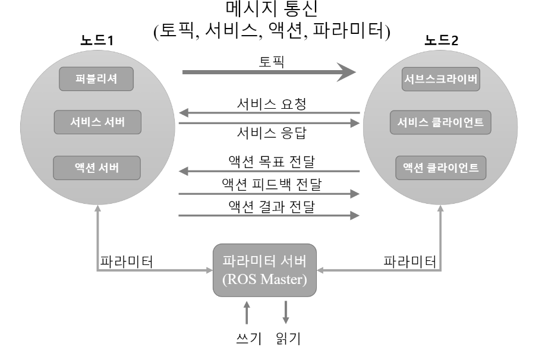
> * Topic, Service, Action은 모두 메시지 사용
> * [ROS위키:msg](https://wiki.ros.org/msg), [ROS위키:common_msg](https://wiki.ros.org/common_msgs)

## Message 통신 예 : turtlesim
```
$ roscore
$ rosrun turtlesim turtle_node
$ rosrun turtlesim turtle_teleop_key
```
* 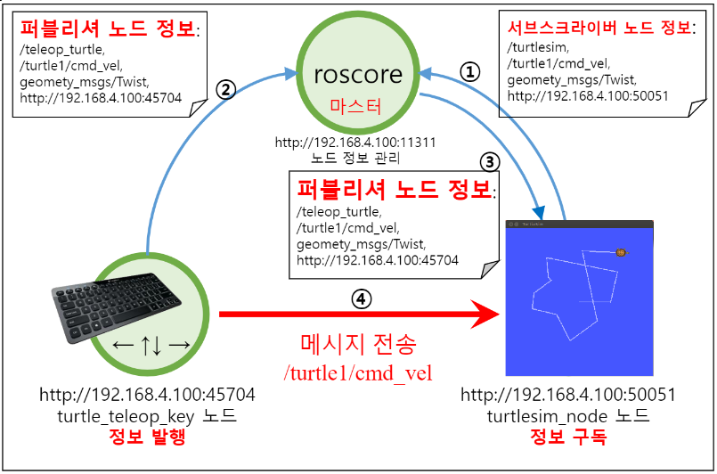
* geometry_msgs/Twist 메시지 통신 
* 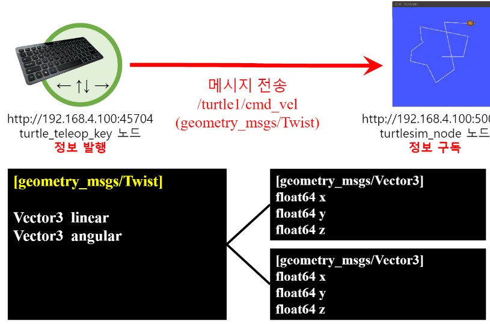
