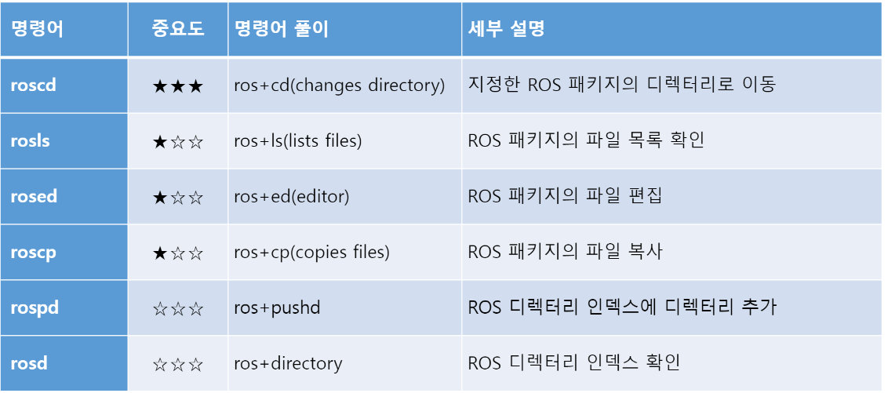
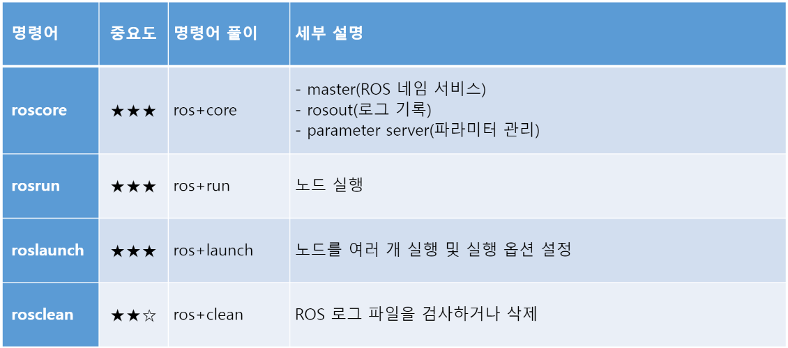
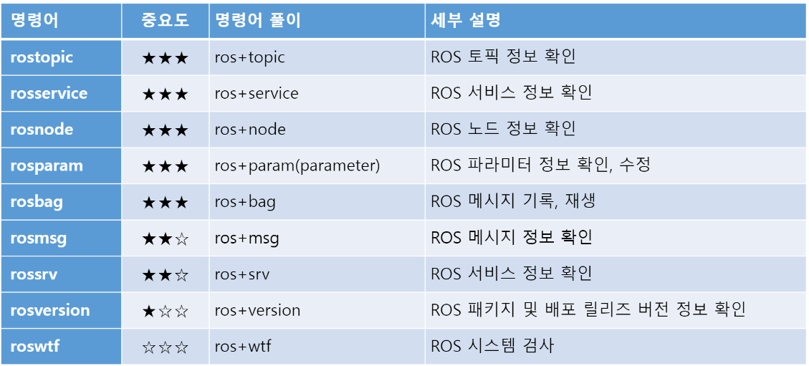
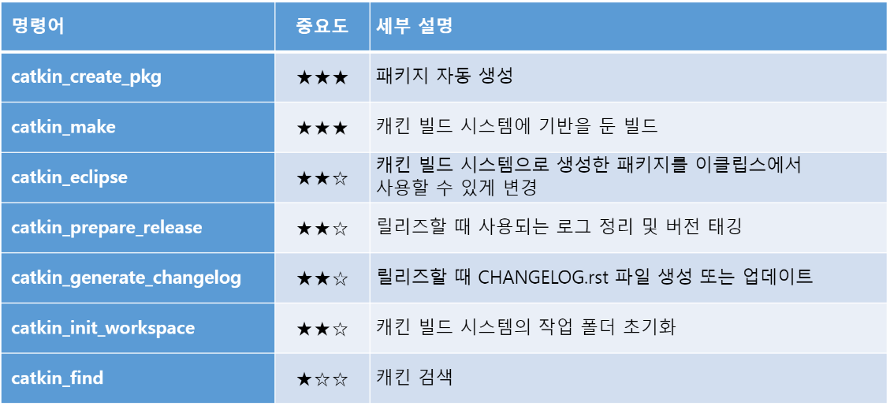
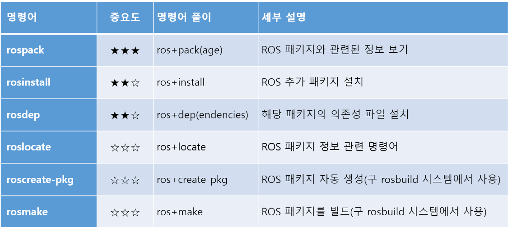

## ROS Shell 명령어 
*  
```
$ roscd [패키지 이름] # 패키지가 저장된 디렉터리로 이동하는 명령어
$ rosls [패키지 이름] # 지정한 ROS 패키지의 파일 목록을 확인하는 명령어
$ rosed [패키지 이름] [파일 이름] # 패키지의 특정 파일을 편집할 때 사용하는 명령어 
```

## ROS 실행 명령어
* 
```
$ roscore [옵션] # Node 간의 메시지 통신에서 연결 정보를 관리하는 Master가 실행 
$ rosrun [패키지 이름] [노드 이름] # 지정한 패키지에서 하나의 노드를 실행하는 명령어
$ roslaunch [패키지 이름] [launch 파일 이름] # launch파일을 이용한 실행은 여러 노드를 실행하는 데 ROS에서 자주 사용되는 실행 방법이다.
$ rosclean [옵션] # check 옵션 : 로그 사용량 검사, purge 옵션 : 로그를 모두 삭제한다.
```

## ROS 정보 명령어
* 
* rosnode 명령어
```
$ rosnode list # roscore에 연결된 모든 노드의 목록을 확인
$ rosnode ping [노드이름] # 지정된 노드와 연결 테스트 
$ rosnode info [노드이름] # 지정된 노드 정보 확인
$ rosnode machine [PC 이름 또는 IP] # 해당 PC에서 실행되고 있는 노드 목록을 확인
$ rosnode kill [노드이름] # 지정된 노드 실행 종료
$ rosnode cleanup # 연결 정보가 확인 안되는 유령 노드의 등록 정보 삭제
```
* rostopic 명령어
```
$ rostopic list # 활성화된 토픽 목록 표시
$ rostopic echo [토픽 이름] # 지정한 토픽의 메시지 내용 실시간 표시 
$ rostopic find [타입 이름] # 지정한 타입의 메시지를 사용하는 토픽 표시
$ rostopic type [토픽 이름] # 지정한 토픽의 메시지 타입 표시
$ rostopic bw [토픽 이름] # 지정한 토픽의 메시지 데이터 대역폭(bandwidth) 표시
$ rostopic hz [토픽 이름] # 지정한 토픽의 메시지 데이터 퍼블리시 주기 표시
$ rostopic info [토픽 이름] # 지정한 토픽의 정보 표시
$ rostopic pub [토픽 이름] [메시지 타입] [파라미터] # 지정한 토픽으로 메시지 퍼블리시 
```
* rosservice 명령어 
```
$ rosservice list # 활성화된 서비스 정보 출력
$ rosservice info [서비스 이름] # 지정한 서비스의 정보 표시 
$ rosservice type [서비스 이름] # 서비스 타입 출력
$ rosservice find [서비스 타입] # 지정한 서비스 타입의 서비스 검색 
$ rosservice uri [서비스 이름] # ROSRPC uri 서비스 출력
$ rosservice args [서비스 이름] # 서비스 파라미터 출력
$ rosservice call [서비스 이름] [파라미터] # 입력된 파라미터로 서비스 요청 
```
* rosparam 명령어 
```
$ rosparam list # 같은 네트워크에서 사용 중인 파라미터 목록 보기
$ rosparam get [파라미터 이름] # 파라미터 값 불러오기 
$ rosparam dump [파일 이름] # 파라미터를 지정한 파일에 저장
$ rosparam set [파라미터 이름] # 파라미터 값 설정 
$ rosparam load [파일 이름] # 지정한 파일을 불러와 현재의 파라미터 값으로 사용
$ rosparam delete [파라미터 이름] # 파라미터 삭제
```
* rosmsg 명령어
```
$ rosmsg list # 모든 메시지 목록 표시
$ rosmsg show [메시지 이름] # 지정한 메시지 정보 표시
$ rosmsg md5 [메시지 이름] # md5sum을 표시
$ rosmsg package [패키지 이름] # 지정한 패키지에서 사용되는 메시지 목록 표시
$ rosmsg packages # 메시지를 사용하는 모든 패키지 목록 표시 
```
* rossrv 명령어
```
$ rossrv list # 모든 서비스 목록 표시
$ rossrv show [서비스 이름] # 지정한 서비스 정보 표시 
$ rossrv md5 [서비스 이름] # md5sum을 표시
$ rossrv package [패키지 이름] # 지정한 패키지에서 사용되는 서비스 목록 표시
$ rossrv packages # 서비스를 사용하는 모든 패키지 목록 표시
```
* rosbag 명령어
```
$ rosbag [옵션][토픽 이름] # 지정한 토픽의 메시지 기록
$ rosbag info [bag 파일 이름] # bag 파일의 정보 확인
$ rosbag play [bag 파일 이름] # 지정한 bag 파일 재생
$ rosbag compress [bag 파일 이름] # 지정한 bag 파일 압축
$ rosbag decompress [bag 파일 이름] # 지정한 bag 파일 압축 해제
```

## ROS catkin 명령어
* 
```
$ catkin_create_pkg [패키지 이름] [의존성 패키지1] [의존성 패키지2] ... # 패키지를 자동으로 생성 
$ catkin_make [옵션] # 캐킨 빌드 시스템에 기반을 둔 빌드 
$ catkin_find [패키지 이름] # 캐킨 검색, 작업 공간을 찾아서 표시 
```

## ROS 패키지 명령어 
* 
```
$ rospack [옵션] [패키지 이름] # 지정한 ROS 패키지의 관련 정보를 표시 
$ rosdep [옵션] # ROS 해당 패키지의 의존성 파일 설치
$ roslocate # ROS 패키지의 정보 표시
```
