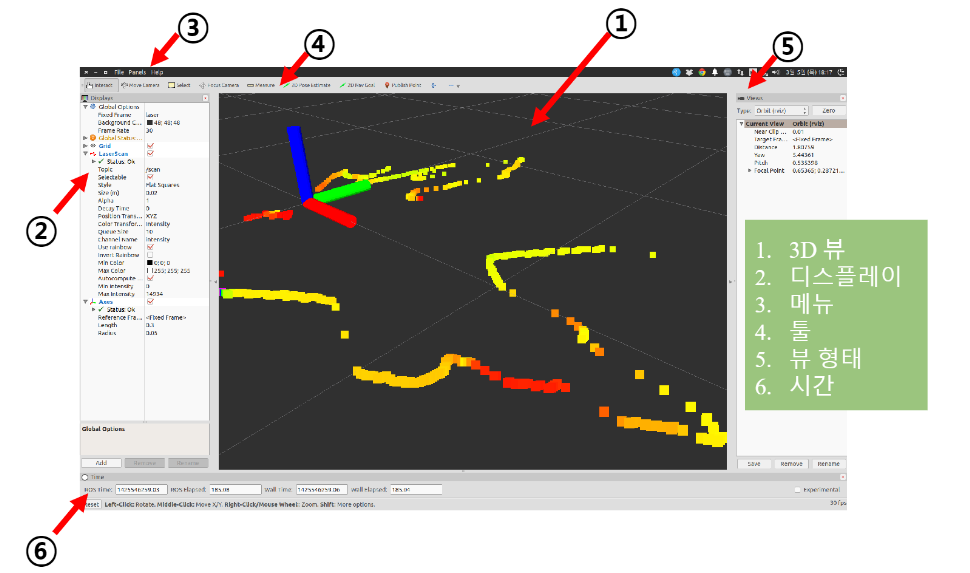
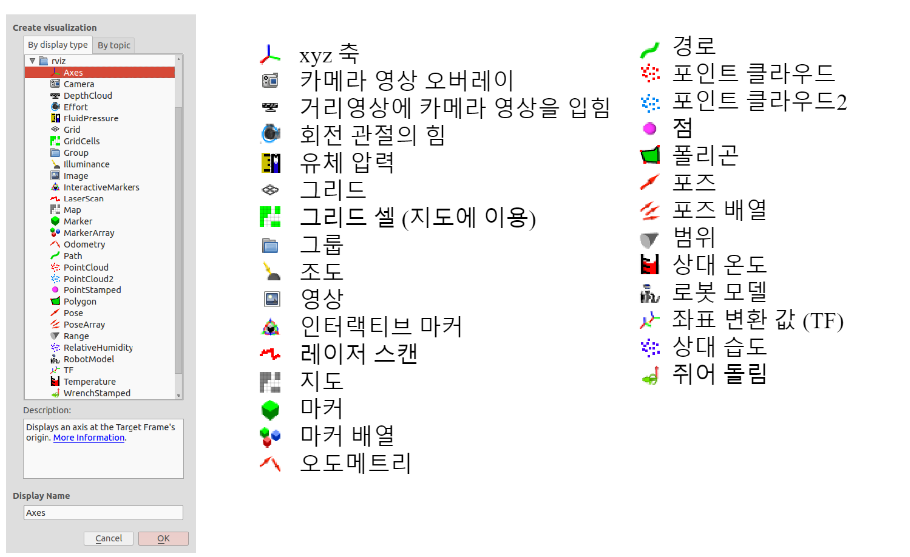

## Riz란? 
* ROS의 3D 시각화 Tool 이다.

## RViz의 주요 기능
* 센서 데이터의 시각화 
> * 카메라 영상 데이터
> * 레이저 거리 센서(LDS)의 거리 데이터
> * RealSense, Kinect, Xtion 등의 Depth Camera의 포인트 클라우드 데이터 
> * IMU 센서의 관성 데이터 
* 로봇의 외형의 표시와 계획된 동작을 표현 
> * URDF(Unified Robot Description Format)
* 지도 표시, 내비게이션, 목적지 지정
* 매니퓰레이션
* 원격 제어

## RViz의 화면 구성
*  
1. 3D 뷰 : 각종 데이터를 3차원으로 볼 수 있는 메인 화면이다. 3D 뷰의 설정은 디스플레이의 Global Option에서 지정한다.
2. 디스플레이 : 디스플레이는 화면 왼쪽 아래에 [Add]를 클릭하면 추가할 디스플레이 종류를 선택할 수 있다. 
> * 
3. 메뉴 : 현재의 디스플레이 상태를 저장하거나 읽어오는 명령, 각종 패널을 선택할 수 있다. 
4. 도구 : 상단에 있는 버튼들로서 인터렉트, 카메라 이동, 선택, 카메라 초점 변경, 거리 측정, 2차원 위치 추정, 2차원 내비게이션 목표점, 퍼블리시 포인트 등 다양한 기능의 도구를 버튼으로 선택할 수 있다. 
5.뷰 : 3D 뷰의 시점을 설정한다. 
> * Orbit 디폴트 값으로 지정 시점을 포커스라하며 이를 중심으로 회전한다. 
> * FPS : 1인칭 게임 시점으로 보여준다. 
> *  ThirdPersonFollower : 3인칭 시점에서 특정 대상을 쫓아가는 뷰를 보여준다. 
> *  TopDownOrtho: Z축이 기준이며 다른 뷰들과는 달리 원근법이 아닌 정사법으로 보여준다. 
> *  XYOrbit : Orbit과 비슷하지만 포커스는 Z축이 아니고 Z축이 0인 XY 평면에 고정되어 있다. 
6. 시간 : 현재 시간과 ROS Time 그리고 이들의 각각의 경과 시간을 보여준다. 

## RQT란?
* 플러그인 방식의 ROS의 종합 GUI Tool 이다.
* rqt는 Qt로 개발되어 있어 유저들이 자유롭게 플러그인을 개발하여 추가할 수 있다. 

## RQT 플러그인 
