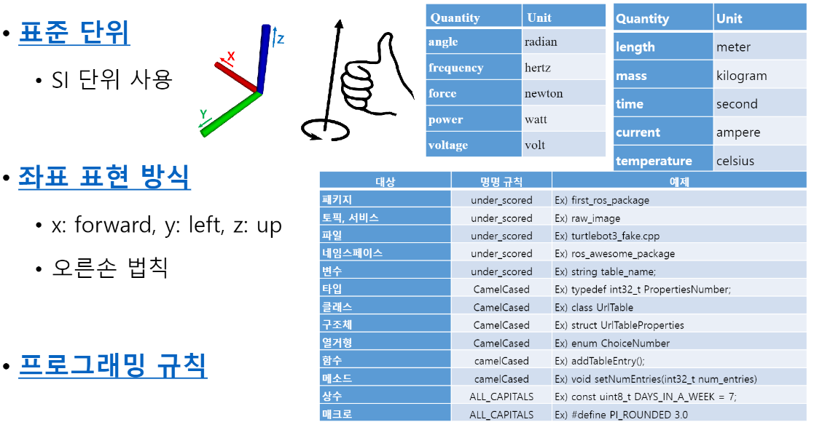
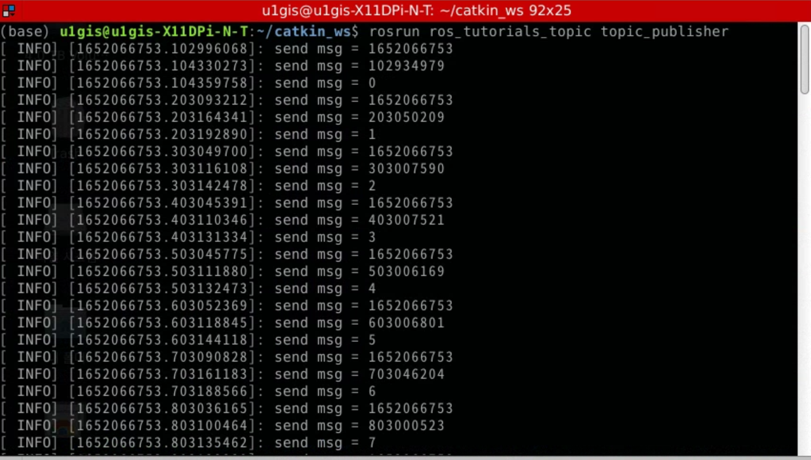
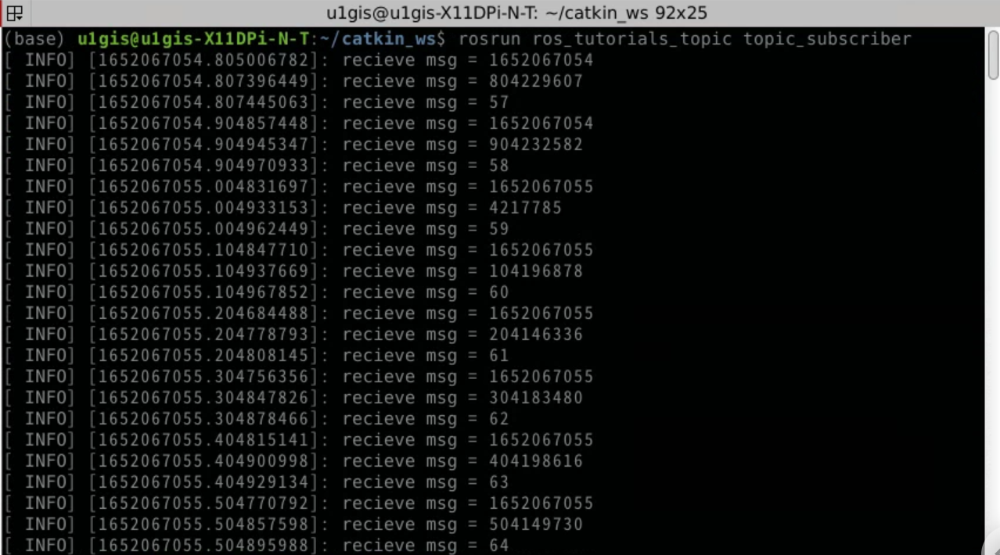
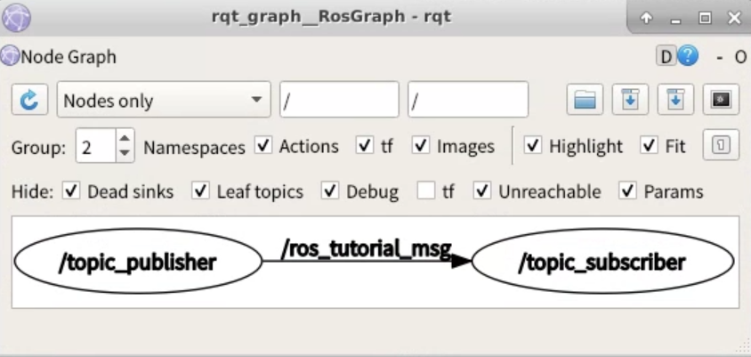
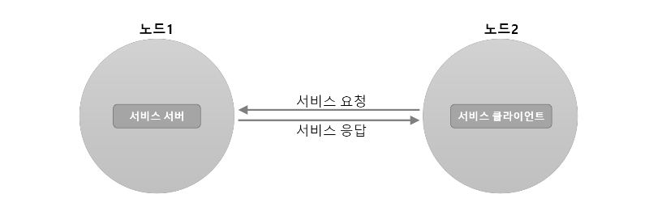
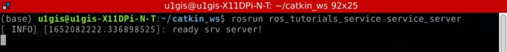
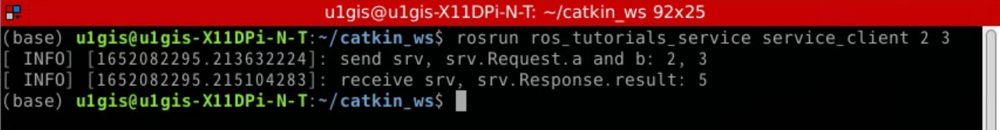
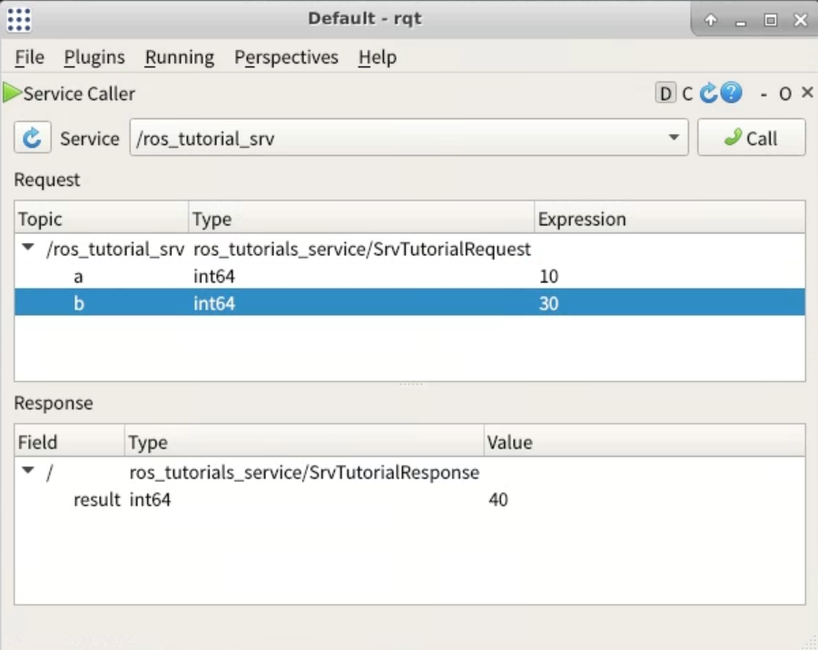
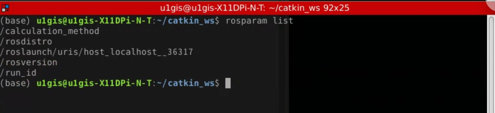
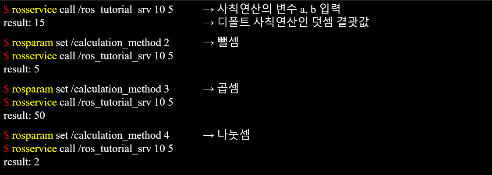

## ROS 프로그래밍 전에 알아둬야 할 사항 
*  

## Topic / Publisher / Subscriber 
*  
> * ROS에서는 단방향 통신일때 'Topic' 이라는 메시지 통신을 사용한다. 이때 송신 측을 Publisher, 수신 측을 Subscriber 라고 부른다. 
1. 패키지 생성 
```
$ cd ~/catkin_ws/src
$ catkin_create_pkg ros_tutorials_topic message_generation std_msgs roscpp
```
```
$ cd ros_tutorials_topic
$ ls 
include         -> 헤더 파일 폴더
src             -> 소스 코드 폴더
CMakeLists.txt  -> 빌드 설정 파일
package.xml     -> 패키지 설정 파일
```
2. 패키지 설정 파일(package.xml) 수정
* ROS의 필수 설정 파일 중 하나인 package.xml은 패키지 정보를 담은 XML 파일로서 패키지 이름, 저작자, 라이선스, 의존성 패키지 등을 기술하고 있다. 
```
$ gedit package.xml
```
```xml
<?xml version="1.0"?>
<package>
  <name>ros_tutorials_topic</name>
  <version>0.1.0</version>
  <description>ROS turtorial package to learn the topic</description>
  <license>Apache License 2.0</license>
  <author email="pyo@robotis.com">Yoonseok Pyo</author>
  <maintainer email="pyo@robotis.com">Yoonseok Pyo</maintainer>
  <url type="bugtracker">https://github.com/ROBOTIS-GIT/ros_tutorials/issues</url>
  <url type="repository">https://github.com/ROBOTIS-GIT/ros_tutorials.git</url>
  <url type="website">http://www.robotis.com</url>
  <buildtool_depend>catkin</buildtool_depend>
  <build_depend>roscpp</build_depend>
  <build_depend>std_msgs</build_depend>
  <build_depend>message_generation</build_depend>
  <run_depend>roscpp</run_depend>
  <run_depend>std_msgs</run_depend>
  <run_depend>message_runtime</run_depend>
  <export></export>
</package>
```
3. 빌드 설정 파일(CMakeLists.txt) 수정
```
$ gedit CMakeLists.txt 
```
```txt
cmake_minimum_required(VERSION 2.8.3)
project(ros_tutorials_topic)

## 캐킨 빌드를 할 때 요구되는 구성요소 패키지이다.
## 의존성 패키지로 message_generation, std_msgs, roscpp이며 이 패키지들이 존재하지 않으면 빌드 도중에 에러가 난다.
find_package(catkin REQUIRED COMPONENTS message_generation std_msgs roscpp)

## 메시지 선언: MsgTutorial.msg
add_message_files(FILES MsgTutorial.msg)

## 의존하는 메시지를 설정하는 옵션이다. 
## std_msgs가 설치되어 있지 않다면 빌드 도중에 에러가 난다.
generate_messages(DEPENDENCIES std_msgs)

## 캐킨 패키지 옵션으로 라이브러리, 캐킨 빌드 의존성, 시스템 의존 패키지를 기술한다.
catkin_package(
  LIBRARIES ros_tutorials_topic
  CATKIN_DEPENDS std_msgs roscpp
)

## include 디렉터리를 설정한다.
include_directories(${catkin_INCLUDE_DIRS})

## topic_publisher 노드에 대한 빌드 옵션이다.
## 실행 파일, 타깃 링크 라이브러리, 추가 의존성 등을 설정한다. 
add_executable(topic_publisher src/topic_publisher.cpp)
add_dependencies(topic_publisher ${${PROJECT_NAME}_EXPORTED_TARGETS} ${catkin_EXPORTED_TARGETS})
target_link_libraries(topic_publisher ${catkin_LIBRARIES})

## topic_subscriber 노드에 대한 빌드 옵션이다. 
add_executable(topic_subscriber src/topic_subscriber.cpp)
add_dependencies(topic_subscriber ${${PROJECT_NAME}_EXPORTED_TARGETS} ${catkin_EXPORTED_TARGETS})
target_link_libraries(topic_subscriber ${catkin_LIBRARIES})
```
4. 메시지 파일 작성
```
$ roscd ros_tutorials_topic # 패키지 폴더로 이동
$ mkdir msg                 # 패키지에 msg라는 메시지 폴더를 신규 작성
$ cd msg                    # 작성한 msg 폴더로 이동
$ gedit MsgTutorial.msg     # MsgTutorial.msg 파일 신규 작성 및 내용 수정
```
* (메시지 형식) (메시지 이름) 
```
time stamp
int32 data
```
* 메시지 타입은 time과 int32 이외에도 bool, int8, int16, float32, string, time, duration 등 메시지 기본 타입과 ROS 에서 많이 사용되는 메시지를 모아놓은 common_msgs 등도 있다.
5. 퍼블리셔 노드 작성
```
$ cd src                      # ros_tutorials_topic 패키지의 소스 폴더인 src 폴더로 이동
$ gedit topic_publisher.cpp   # 소스 파일 신규 작성 및 내용 수정
```
```cpp
#include "ros/ros.h"                            // ROS 기본 헤더파일
#include "ros_tutorials_topic/MsgTutorial.h"    // MsgTutorial 메시지 파일 헤더(빌드 후 자동 생성됨)

int main(int argc, char **argv)                 // 노드 메인 함수
{
  ros::init(argc, argv, "topic_publisher");     // 노드명 초기화
  ros::NodeHandle nh;                           // ROS 시스템과 통신을 위한 노드 핸들 선언

  // 퍼블리셔 선언, ros_tutorials_topic 패키지의 MsgTutorial 메시지 파일을 이용한 퍼블리셔 ros_tutorial_pub 를 작성한다.
  // 토픽명은 "ros_tutorial_msg"이며, 퍼블리셔 큐(queue) 사이즈를 100개로 설정한다. 
  ros::Publisher ros_tutorial_pub = nh.advertise<ros_tutorials_topic::MsgTutorial>("ros_tutorial_msg", 100);

  // 루프 주기를 설정한다. "10" 이라는 것은 10Hz를 말하는 것으로 0.1초 간격으로 반복된다. 
  ros::Rate loop_rate(10);

  ros_tutorials_topic::MsgTutorial msg;     // MsgTutorial 메시지 파일 형식으로 msg 라는 메시지를 선언
  int count = 0;                            // 메시지에 사용될 변수 선언 

  while (ros::ok())
  {
    msg.stamp = ros::Time::now();           // 현재 시간을 msg의 하위 stamp 메시지에 담는다.
    msg.data  = count;                      // count라는 변수 값을 msg의 하위 data 메시지에 담는다.

    ROS_INFO("send msg = %d", msg.stamp.sec);   // stamp.sec 메시지를 표시한다.
    ROS_INFO("send msg = %d", msg.stamp.nsec);  // stamp.nsec 메시지를 표시한다.
    ROS_INFO("send msg = %d", msg.data);        // data 메시지를 표시한다.

    ros_tutorial_pub.publish(msg);          // 메시지를 발행한다.

    loop_rate.sleep();                      // 위에서 정한 루프 주기에 따라 슬립에 들어간다.

    ++count;                                // count 변수 1씩 증가
  }

  return 0;
}
```
6. 서브스크라이버 노드 작성 
```
$ ros tutorial_topic/src        # 패키지의 소스 폴더인 src 폴더로 이동
$ gedit topic_subscriber.cpp    # 소스 파일 신규 작성 및 내용 수정
```
```cpp
#include "ros/ros.h"                          // ROS 기본 헤더파일
#include "ros_tutorials_topic/MsgTutorial.h"  // MsgTutorial 메시지 파일 헤더(빌드 후 자동 생성됨)

// 메시지 콜백 함수로써, 설정한 ros_tutorial_msg라는 이름의 토픽 메시지를 수신하였을 때 동작하는 함수이다.
// 입력 메시지로는 ros_tutorials_topic 패키지의 MsgTutorial 메시지를 받도록 되어있다. 
void msgCallback(const ros_tutorials_topic::MsgTutorial::ConstPtr& msg)
{
  ROS_INFO("recieve msg = %d", msg->stamp.sec);   // Prints the 'stamp.sec' message
  ROS_INFO("recieve msg = %d", msg->stamp.nsec);  // Prints the 'stamp.nsec' message
  ROS_INFO("recieve msg = %d", msg->data);        // Prints the 'data' message
}

int main(int argc, char **argv)                         // 노드 메인 함수
{
  ros::init(argc, argv, "topic_subscriber");            // 노드명 초기화

  ros::NodeHandle nh;                                   // ROS 시스템과 통신을 위한 노드 핸들 선언
  
  // 서브스크라이버 선언, ros_tutorial_topic 패키지의 MsgTutorial 메시지 파일을 이용한 서브스크라이버 ros_tutorial_sub 를 작성한다.
  // 토픽명은 "ros_tutorial_msg" 이며 서브스크라이버 큐(queue) 사이즈를 100개로 설정한다.
  ros::Subscriber ros_tutorial_sub = nh.subscribe("ros_tutorial_msg", 100, msgCallback);

  //콜백함수 호출을 위한 함수로써, 메시지가 수신되기를 대기, 수신되었을 경우 콜백함수를 실행한다.
  ros::spin();

  return 0;
}
```
7. ROS 노드 빌드
```
$ cd ~/catkin_ws    # catkin 폴더로 이동
$ catkin_make       # catkin 빌드 실행
```
* 빌드된 결과물은 /catkin_ws의 /build와 /devel 폴더에 각각 생성
* /build 폴더에는 캐킨 빌드에서 사용된 설정 내용이 저장
* /devel/lib/ros_tutorials_topic 폴더에는 실행 파일이 저장
* /devel/include/ros_tutorials_topic 폴더에는 메시지 파일로부터 자동 생성된 메시지 헤더파일이 저장
8. 퍼블리셔 실행 
```
$ rosrun ros_tutorials_topic topic_publisher
```
*  
* rostopic 명령어를 이용하여 현재 ROS 네트워크에서 사용중인 토픽 목록, 주기, 데이터 대역폭, 내용 확인 등이 가능하다. 
```
$ rostopic list
$ rostopic hz /ros_tutorial_msg
$ rostopic bw /ros_tutorial_msg
$ rostopic echo /ros_tutorial_msg
```
9. 서브스크라이버 실행 
```
$ rosrun ros_tutorials_topic topic_subscriber 
```
*  
10. 실행된 노드들의 통신 상태 확인 
```
$ rqt_graph
# 또는
$ rqt [Plugins] -> [Introspection] -> [Node Graph]
```
*  

## Service / Service server / Service client
*  
> * ROS에서는 양방향 통신이 필요할때 Service 라는 메시지 통신을 사용한다. 이때 요청(request)이 있을 때만 응답(response)하는 Service server 와 요청하고 응답 받는 Service client 로 나뉜다.
1. 패키지 생성
```
$ cd ~/catkin_ws/src
$ catkin_create_pkg ros_tutorials_service message_generation std_msgs roscpp
```
```
$ cd ros_tutorials_service
$ ls 
include         -> 헤더 파일 폴더
src             -> 소스 코드 폴더
CMakeLists.txt  -> 빌드 설정 파일
package.xml     -> 패키지 설정 파일
```
2. 패키지 설정 파일(package.xml) 수정
* ROS의 필수 설정 파일 중 하나인 package.xml은 패키지 정보를 담은 XML 파일로서 패키지 이름, 저작자, 라이선스, 의존성 패키지 등을 기술하고 있다. 
```
$ gedit package.xml
```
```xml
<?xml version="1.0"?>
<package>
  <name>ros_tutorials_service</name>
  <version>0.1.0</version>
  <description>ROS turtorial package to learn the service</description>
  <license>Apache License 2.0</license>
  <author email="pyo@robotis.com">Yoonseok Pyo</author>
  <maintainer email="pyo@robotis.com">Yoonseok Pyo</maintainer>
  <url type="bugtracker">https://github.com/ROBOTIS-GIT/ros_tutorials/issues</url>
  <url type="repository">https://github.com/ROBOTIS-GIT/ros_tutorials.git</url>
  <url type="website">http://www.robotis.com</url>
  <buildtool_depend>catkin</buildtool_depend>
  <build_depend>roscpp</build_depend>
  <build_depend>std_msgs</build_depend>
  <build_depend>message_generation</build_depend>
  <run_depend>roscpp</run_depend>
  <run_depend>std_msgs</run_depend>
  <run_depend>message_runtime</run_depend>
  <export></export>
</package>
```
3. 빌드 설정 파일(CMakeLists.txt) 수정
```
cmake_minimum_required(VERSION 2.8.3)
project(ros_tutorials_service)

## 캐킨 빌드를 할 때 요구되는 구성요소 패키지이다.
## 의존성 패키지로 message_generation, std_msgs, roscpp이며 이 패키지들이 존재하지 않으면 빌드 도중에 에러가 난다.
find_package(catkin REQUIRED COMPONENTS message_generation std_msgs roscpp)

# 서비스 선언: SrvTutorial.srv
add_service_files(FILES SrvTutorial.srv)

## 의존하는 메시지를 설정하는 옵션이다.
## std_msgs가 설치되어 있지 않다면 빌드 도중에 에러가 난다.
generate_messages(DEPENDENCIES std_msgs)

## 캐킨 패키지 옵션으로 라이브러리, 캐킨 빌드 의존성, 시스템 의존 패키지를 기술한다.
catkin_package(
  LIBRARIES ros_tutorials_service
  CATKIN_DEPENDS std_msgs roscpp
)

## include 디렉터리를 설정한다.
include_directories(${catkin_INCLUDE_DIRS})

## servce_server 노드에 대한 빌드 옵션이다.
## 실행파일, 타겟 링크 라이브러리, 추가 의존성 등을 설정한다.
add_executable(service_server src/service_server.cpp)
add_dependencies(service_server ${${PROJECT_NAME}_EXPORTED_TARGETS} ${catkin_EXPORTED_TARGETS})
target_link_libraries(service_server ${catkin_LIBRARIES})

## service_client 노드에 대한 빌드 옵션이다.
add_executable(service_client src/service_client.cpp)
add_dependencies(service_client ${${PROJECT_NAME}_EXPORTED_TARGETS} ${catkin_EXPORTED_TARGETS})
target_link_libraries(service_client ${catkin_LIBRARIES})
```
4. 서비스 파일 작성
```
$ roscd ros_tutorials_service # 패키지 폴더로 이동
$ mkdir srv                   # 패키지에 srv라는 서비스 폴더를 신규 작성
$ cd srv                      # 작성한 srv 폴더로 이동
$ gedit SrvTutorial.srv       # SrvTutorial.srv 파일 신규 작성 및 내용 수정
```
* (메시지 형식) (서비스 요청: request)
* --- (요청과 응답을 구분하는 구분자)
* (메시지 형식) (서비스 응답: response) 
```
int64 a
int64 b
---
int64 result
```
5. 서비스 서버 노드 작성
```
$ roscd ros_tutorials_service/src   # 패키지의 소스 폴더인 src 폴더로 이동
$ gedit service_server.cpp          # 소스 파일 신규 작성 및 내용 수정
```
```cpp
#include "ros/ros.h"                          // ROS Default Header File
#include "ros_tutorials_service/SrvTutorial.h"// SrvTutorial Service File Header (Automatically created after build)

// The below process is performed when there is a service request
// The service request is declared as 'req', and the service response is declared as 'res'
bool calculation(ros_tutorials_service::SrvTutorial::Request &req,
                 ros_tutorials_service::SrvTutorial::Response &res)
{
  // The service name is 'ros_tutorial_srv' and it will call 'calculation' function upon the service request.
  res.result = req.a + req.b;

  // Displays 'a' and 'b' values used in the service request and
  // the 'result' value corresponding to the service response
  ROS_INFO("request: x=%ld, y=%ld", (long int)req.a, (long int)req.b);
  ROS_INFO("sending back response: %ld", (long int)res.result);

  return true;
}

int main(int argc, char **argv)              // Node Main Function
{
  ros::init(argc, argv, "service_server");   // Initializes Node Name
  ros::NodeHandle nh;                        // Node handle declaration

  // Declare service server 'ros_tutorials_service_server'
  // using the 'SrvTutorial' service file in the 'ros_tutorials_service' package.
  // The service name is 'ros_tutorial_srv' and it will call 'calculation' function
  // upon the service request.
  ros::ServiceServer ros_tutorials_service_server = nh.advertiseService("ros_tutorial_srv", calculation);

  ROS_INFO("ready srv server!");

  ros::spin();    // Wait for the service request

  return 0;
}
```
6. 서비스 클라이언트 노드 작성 
```
$ roscd ros_tutorials_service/src   # 패키지의 소스 폴더인 src 폴더로 이동
$ gedit service_client.cpp          # 소스 파일 신규 작성 및 내용 수정
```
```cpp
#include "ros/ros.h"                          // ROS Default Header File
#include "ros_tutorials_service/SrvTutorial.h"// SrvTutorial Service File Header (Automatically created after build)
#include <cstdlib>                            // Library for using the "atoll" function

int main(int argc, char **argv)               // Node Main Function
{
  ros::init(argc, argv, "service_client");    // Initializes Node Name

  if (argc != 3)  // Input value error handling
  {
    ROS_INFO("cmd : rosrun ros_tutorials_service service_client arg0 arg1");
    ROS_INFO("arg0: double number, arg1: double number");
    return 1;
  }

  ros::NodeHandle nh;       // Node handle declaration for communication with ROS system

  // Declares service client 'ros_tutorials_service_client'
  // using the 'SrvTutorial' service file in the 'ros_tutorials_service' package.
  // The service name is 'ros_tutorial_srv'
  ros::ServiceClient ros_tutorials_service_client = nh.serviceClient<ros_tutorials_service::SrvTutorial>("ros_tutorial_srv");

  // Declares the 'srv' service that uses the 'SrvTutorial' service file
  ros_tutorials_service::SrvTutorial srv;

  // Parameters entered when the node is executed as a service request value are stored at 'a' and 'b'
  srv.request.a = atoll(argv[1]);
  srv.request.b = atoll(argv[2]);

  // Request the service. If the request is accepted, display the response value
  if (ros_tutorials_service_client.call(srv))
  {
    ROS_INFO("send srv, srv.Request.a and b: %ld, %ld", (long int)srv.request.a, (long int)srv.request.b);
    ROS_INFO("receive srv, srv.Response.result: %ld", (long int)srv.response.result);
  }
  else
  {
    ROS_ERROR("Failed to call service ros_tutorial_srv");
    return 1;
  }
  return 0;
}
```
7. ROS 노드 빌드 
```
$ cd ~/catkin_ws && catkin_make   # catkin 폴더로 이동 후 catkin 빌드 실행
```
* ros_tutorials_service 패키지의 소스 코드 파일: ~/catkin_ws/src/ros_tutorials_service/src
* ros_tutorials_service 패키지의 메시지 파일: ~/catkin_ws/src/ros_tutorials_sercie/msg
* ~/catkin_ws/build : 캐킨 빌드에서 사용된 설정 내용이 저장
* ~/catkin_ws/devel/lib/ros_tutorials_service : 실행 파일이 저장
* ~/catkin_ws/devel/include/ros_tutorials_service 메시지 파일로부터 자동 생성된 메시지 헤더 파일이 저장
8. 서비스 서버 실행 
*  
* 서비스 서버는 서비스 요청이 있기 전까지 아무런 처리를 하지 않고 기다린다
9. 서비스 클라이언트 실행
*  
* 서비스 클라이언트는 실행 매개변수 2와 3을 a와 b값으로 서비스를 요청하게 되고 결괏값으로 둘의 합인 5를 응답값으로 전송
* 서비스는 일회성 메시지 통신이기 때문에 요청과 응답이 완료되면 두 노드의 접속이 끊긴다
```
$ rosservice call /ros_tutorial_srv 5 15
result: 20
```
* 서비스 요청은 서버와 클라이언트 두 노드를 실행하는 방법 말고도 rosservice call 명령어를 이용해 통신하는 방법도 있다
```
$ rqt
[Plugins] -> [Service] -> [Service Caller]
```
*  
* service 선택 후에 a = 10, b = 30 입력하고, Call 버튼을 누르면 Result에 40 값이 표시된다

## Parameter
1. 파라미터를 활용한 노드 작성 
* service_server.cpp 소스를 수정하여 서비스 요청으로 입력된 a와 b를 단순히 덧셈하는 것이 아니라, 사칙연산이 가능하도록 파라미터를 활용해 본다
```
$ roscd ros_tutorials_service/src
$ gedit service_server.cpp
```
```cpp
#include "ros/ros.h"                            // ROS Default Header File
#include "ros_tutorials_parameter/SrvTutorial.h"// action Library Header File

#define PLUS            1   // Addition
#define MINUS           2   // Subtraction
#define MULTIPLICATION  3   // Multiplication
#define DIVISION        4   // Division

int g_operator = PLUS;

// The process below is performed if there is a service request
// The service request is declared as 'req', and the service response is declared as 'res'
bool calculation(ros_tutorials_parameter::SrvTutorial::Request &req,
                 ros_tutorials_parameter::SrvTutorial::Response &res)
{
  // The operator will be selected according to the parameter value and calculate 'a' and 'b',
  // which were received upon the service request.
  // The result is stored as the Response value.
  switch(g_operator)
  {
    case PLUS:
         res.result = req.a + req.b; break;
    case MINUS:
         res.result = req.a - req.b; break;
    case MULTIPLICATION:
         res.result = req.a * req.b; break;
    case DIVISION:
         if(req.b == 0)
         {
           res.result = 0; break;
         }
         else
         {
           res.result = req.a / req.b; break;
         }
    default:
         res.result = req.a + req.b; break;
  }

  // Displays the values of 'a' and 'b' used in the service request, and the 'result' value
  // corresponding to the service response.
  ROS_INFO("request: x=%ld, y=%ld", (long int)req.a, (long int)req.b);
  ROS_INFO("sending back response: [%ld]", (long int)res.result);

  return true;
}

int main(int argc, char **argv)             // Node Main Function
{
  ros::init(argc, argv, "service_server");  // Initializes Node Name
  ros::NodeHandle nh;                       // Node handle declaration

  nh.setParam("calculation_method", PLUS);  // Reset Parameter Settings

  // Declare service server 'service_server' using the 'SrvTutorial' service file
  // in the 'ros_tutorials_service' package. The service name is 'ros_tutorial_srv' and
  // it is set to execute a 'calculation' function when a service is requested.
  ros::ServiceServer ros_tutorials_service_server = nh.advertiseService("ros_tutorial_srv", calculation);

  ROS_INFO("ready srv server!");

  ros::Rate r(10);  // 10 hz

  while (ros::ok())
  {
    nh.getParam("calculation_method", g_operator);  // Select the operator according to the value received from the parameter.
    ros::spinOnce();  // Callback function process routine
    r.sleep();        // Sleep for routine iteration
  }

  return 0;
}
```
2. 노드 빌드 및 실행
```
$ cd ~/catkin_ws && catkin_make
```
```
$ rosrun ros_tutorials_service service_server
```
3. 매개변수 목록 보기 
*  
4. 파라미터 사용 예
* 파라미터 값을 변경하여 서비스 요청 결과를 바꿀 수 있다 
*  
