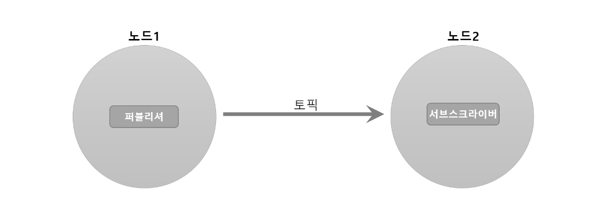

## ROS 프로그래밍 전에 알아둬야 할 사항 
*  

## Topic / Publisher / Subscriber 
*  
> * ROS에서는 단방향 통신일때 'Topic' 이라는 메시지 통신을 사용한다. 이때 송신 측을 Publisher, 수신 측을 Subscriber 라고 부른다. 
1. 패키지 생성 
```
$ cd ~/catkin_ws/src
$ catkin_create_pkg ros_tutorials_topic message_generation std_msgs roscpp
```
```
$ cd ros_tutorials_topic
$ ls 
include         -> 헤더 파일 폴더
src             -> 소스 코드 폴더
CMakeLists.txt  -> 빌드 설정 파일
package.xml     -> 패키지 설정 파일
```
2. 패키지 설정 파일(package.xml) 수정
* ROS의 필수 설정 파일 중 하나인 package.xml은 패키지 정보를 담은 XML 파일로서 패키지 이름, 저작자, 라이선스, 의존성 패키지 등을 기술하고 있다. 
```
$ gedit package.xml
```
```xml
<?xml version="1.0"?>
<package>
  <name>ros_tutorials_topic</name>
  <version>0.1.0</version>
  <description>ROS turtorial package to learn the topic</description>
  <license>Apache License 2.0</license>
  <author email="pyo@robotis.com">Yoonseok Pyo</author>
  <maintainer email="pyo@robotis.com">Yoonseok Pyo</maintainer>
  <url type="bugtracker">https://github.com/ROBOTIS-GIT/ros_tutorials/issues</url>
  <url type="repository">https://github.com/ROBOTIS-GIT/ros_tutorials.git</url>
  <url type="website">http://www.robotis.com</url>
  <buildtool_depend>catkin</buildtool_depend>
  <build_depend>roscpp</build_depend>
  <build_depend>std_msgs</build_depend>
  <build_depend>message_generation</build_depend>
  <run_depend>roscpp</run_depend>
  <run_depend>std_msgs</run_depend>
  <run_depend>message_runtime</run_depend>
  <export></export>
</package>
```
