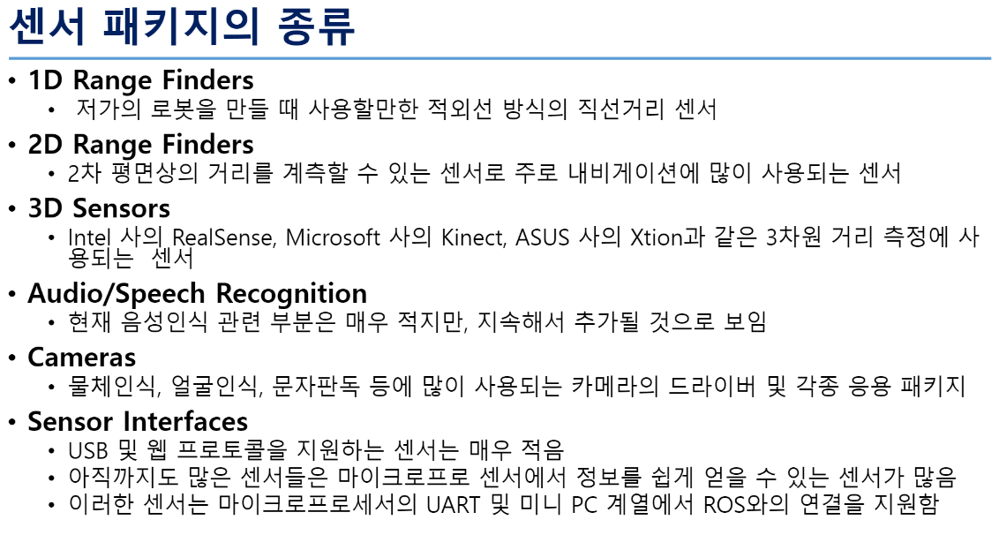

## 로봇 패키지
* [ROS가 도입한 로봇의 패키지 공식 사이트](http://robots.ros.org)
* 로봇 패키지는 공개된 ROS 공식 패키지를 설치하던가, 위키에서 안내하는 설치 방법에 따라 공개 소스 리포지토리로부터 내려받은 다음, 빌드 과정을 거치고 사용하면 된다.

## 센서 패키지
* [ROS가 도입한 센서의 패키지 공식 사이트](http://wiki.ros.org/Sensors)
* 

